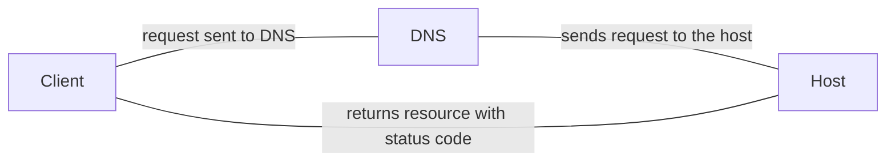

# HTTP
## Structure

URL
![[Pasted image 20220601183806.png]]

1.  scheme:  
2.  user:  credentials separated by a colon e.g. admin:password
3.  host:
4.  port:
5.  path:
6.  query string: Starts with a question mark and includes a parameter and a value separated by an '='.  Multiple paramaters can be used and separataed by a '&'.
7.  fragment:

## Process

## Headers
HTTP headers are sent along with the body (data) of a HTTP request and response. There are several types of HTTP header:
1.  General headers; Used in both request and response and describe the message rather than its contents.
2.  Entity headers;  Can be common to both request and response and describe the content.  Norrmally found in POST and PUT requests.
3.  Request headers;  Request only and do not relate to the content of the message.  
4.  Response headers;  Response only and do not relate to the content of the message.
5.  Security headers;  Are a class of response header used to specify certain rules and policies to be followed by the browserr while accessing the website.
---
# Methods and code
## Request methods
1.  GET;  Request a specific resource.  Additional data can be passed to the server via query strings in the URL (param=value).
2.  POST;  Sends data to the server.  It can handle multiple types of input, such as text, PDF and other forms of binary data.  This data is appended in the request body present after the headers.  The POST method is commonly used when sending information (forms/logins) or uploading data to a websiite.
3.  HEAD; Request the headers that would be returned ifi a GET request was made to the server.  It doesn't return the request body and us usually made to check the response length before downloading resources.
4.  PUT;  Creates new resources on the server.  Allowing this method without proper controls can lead to uploading malicious resources.
5.  DELETE; Deletes an existing resource on the webserver.  If not properly secured, can lead to Denial or Service by deleting criitical files on the web server.
6.  OPTIONS; Returns information about the server, such as the methods accepted by it.
7.  PATCH; Applies a partial modificatiion to the resources at the specified location.

## Response codes
### Types
1.  1xx; Provides information and does not affect the processing of the request.
2.  2xx; Returned when a request suceeds.
3.  3xx; Returned when the server redirects the client.
4.  4xx; Signifies improper requests from the client.  A resource that doesn't exist.
5.  5xx; Returned when there is somoe problem with the HTTP server itself.

### Codes
1.  200; Ok, successful.
2.  302; Found. redirection.
3.  400; bad request.
4.  403; Forbidden.
5.  404; Not found.
6.  500; Internal server error.

# Get

This is the default request type when obtaining resources from a website.

---
# POST
Unlike a GET request, which places the parameters in the URL, a POST request puts them in the body.

# API
## Read
~~~ bash
# Read

# curl -s --> using curl with the -s flag to silence the output.

# <IP address of the host>
# :<port number of the host>
# /api.php --> Resource page.  This is basically the API endpoint
#  /city --> Table that is to be queried
# / london --> search for london in the city table 
# | pipe the output to the jq application.  jq is a json processing application

curl -s http://<server_IP>:<port>/api.php/city/london | jq

~~~
[^1]: [[jq]] is a light weight command line application for processing json data.

## Create
To add a new entry we use the HTTP POST method 

~~~ bash

curl -X POST http://<IP address>:<port>/api.php/city/ -d ' {"city_name":"HTB_City", "country_name":"HTB"} ' -H 'Content_Type: application/json'

# -d --> data to be sent
# -H set header for content type

~~~

## Update
PUT is used to update data through an API.  PATCH is also used to update entries, however, normally only used for a partial update, whilst PUT is used to update the entire entry.

PUT and POST are very similar, the principal difference being that with PUT we need to specify the entry that is to be udpated i.e. the entry within the table.

~~~ bash

# Note that 'london' is the entry that we are updating.

curl -X PUT http://<IP address>:<port>/api.php/city/london -d '{"city_name":"New_HTB_CITY", "country_name":"HTB"}' -H 'Content_Type: application/json'

~~~

In some applications the update operation may be used to create new entries as well.  In this case, if the entry does not exist, it is created.

## Delete
The DELETE method deletes the specified entry.
? Does and empty entry delete everything?

~~~ bash

curl -X DELETE http://<IP address>:<port>/api.php/city/New_HTB_City

~~~

